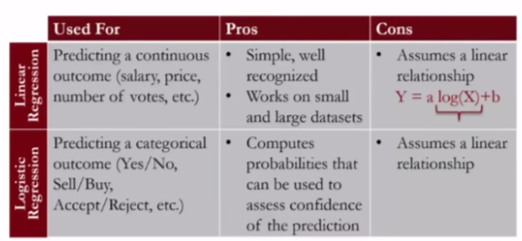
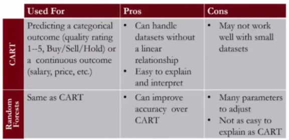
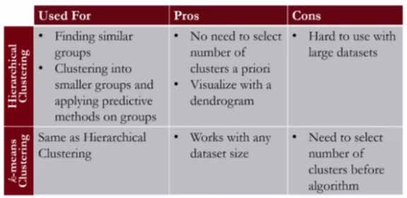

# Clustering

An important aspect of clustering data into smaller groups is that we can improve our prediction accuracy by applying our predictive methods, like logistic regression for instance, on each cluster.

