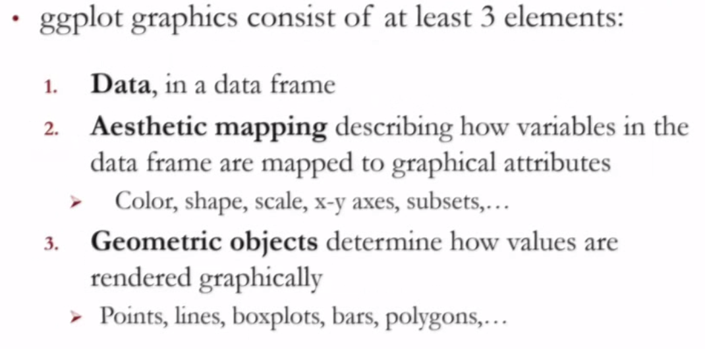
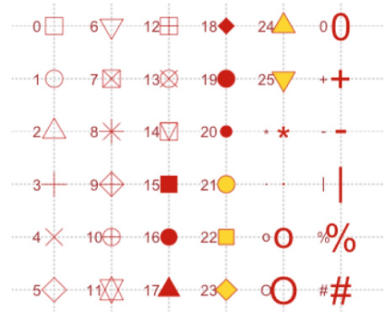

# Visualization 





# Image Options in IPython Notebook:
To countrol image format and image size, use these two options before plotting
```
options(jupyter.plot_mimetypes = 'image/png')
options(repr.plot.width=4, repr.plot.height=3)
```
